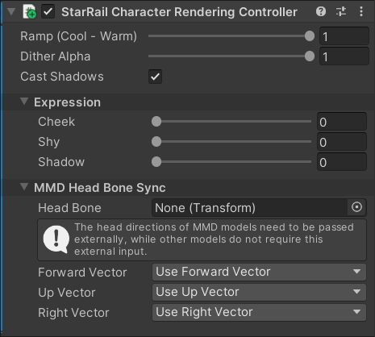
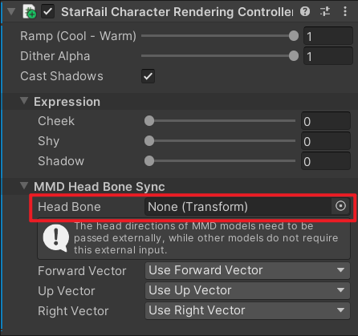

# Setup a character

## Materials

- Before setting up the Material, it is necessary to process textures and smooth normals using asset processors.
- After changing the Material's Shader, remember to reset it.
- If there is no outline/rim light, adjust the `Model Scale` on the Material.

## Character rendering controller

Add the `StarRail Character Rendering Controller` component to the root object of the character.

This component makes it easy to control some rendering parameters. The relevant C# API is as follows:

### Properties

|Name|Description|
|:-|:-|
|RampCoolWarmMix|Blend level of the cool and warm Ramp textures. 0 is cool, 1 is warm. Range $[0, 1]$.|
|DitherAlpha|Transparency of the character. Range $[0, 1]$.|
|ExpressionCheekIntensity|Degree of cheek blush. Range $[0, 1]$.|
|ExpressionShyIntensity|Shyness level. Range $[0, 1]$.|
|ExpressionShadowIntensity|Darkening of the face. Range $[0, 1]$.|
|IsCastingShadow|Whether to cast shadows.|
|PropertyBlock|`MaterialPropertyBlock` used by the controller (Read Only).|

### Methods

|Name|Description|
|:-|:-|
|UpdateRendererList|Update the internal cached list of `Renderer` in the controller.|

## For MMD models

Additional steps are required:

- Change the `Model Type` to `MMD` on the material.
- Drag the `Transform` of the head bone to the `Head Bone` field.

    

**Note that** MMD models do not contain some detailed information so the final rendering result may not fully meet your expectation.
