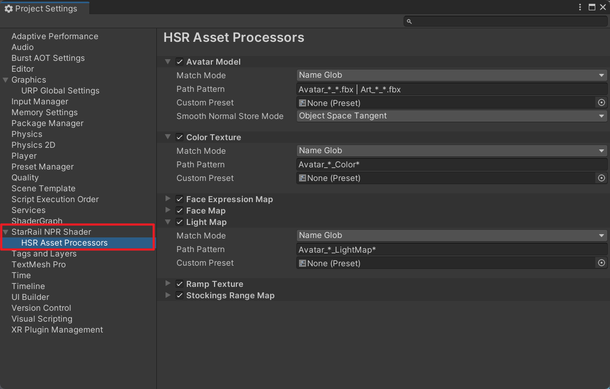

# Working with asset processor

After importing an asset, if its path meets certain requirements, the asset processor will automatically apply presets to it without the need for manual modification of the asset settings. For models, it can also automatically smooth their normals.

You can configure the asset processor in `Project Settings/StarRail NPR Shader/HSR Asset Processors`.

- `Match Mode`: The matching mode for assets.

    - `Name Glob`: `Path Pattern` uses a syntax similar to Unix Glob, ignoring case, to match the asset's name (including the extension).

        - `*`: Matches 0 or more characters.
        - `?`: Matches exactly 1 character.
        - `|`: Separates multiple Globs. For example, `a.* | b.*` means matching either `a.*` or `b.*`.

    - `Regex`: Treats `Path Pattern` as a regular expression to match the complete asset path.
    - `Equals`: Matches successfully if the complete asset path is equal to `Path Pattern`.
    - `Contains`: Matches successfully if the complete asset path contains `Path Pattern`.
    - `Starts With`: Matches successfully if the complete asset path starts with `Path Pattern`.
    - `Ends With`: Matches successfully if the complete asset path ends with `Path Pattern`.

- `Path Pattern`: The pattern string.
- `Ignore Case`: Whether to ignore case during matching.
- `Custom Preset`: Custom preset. If empty, the default preset is used.
- `Smooth Normal Store Mode`: The mode for storing smoothed normals in models.
