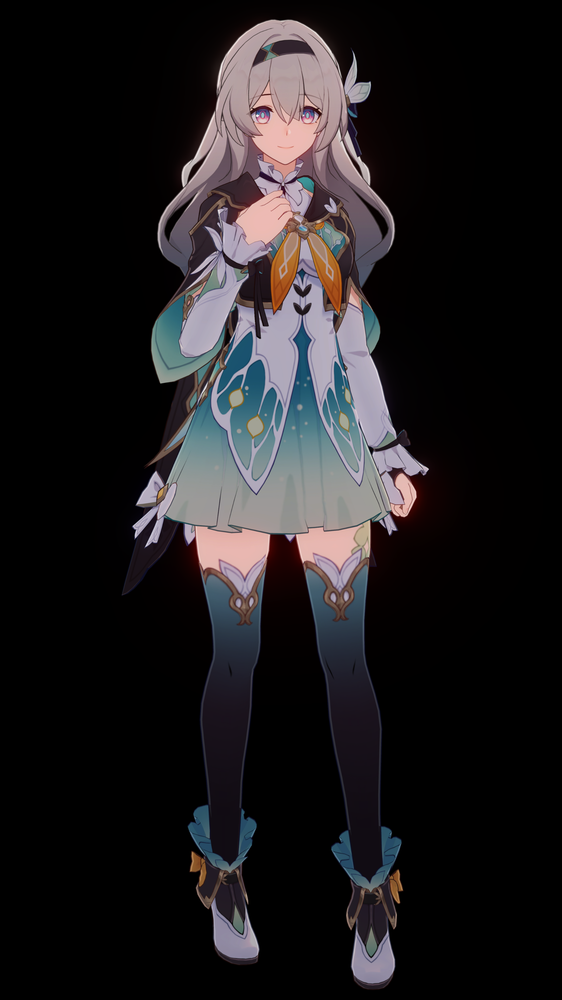

# StarRail NPR Shader

  

[English](../../README.md) | [简体中文](README.md)

这是基于 Unity URP 的仿星穹铁道渲染 Shader。这不是逆向工程，Shader 代码不可能和游戏里的一模一样，我只是尽力去还原渲染效果。

↑↑↑ 花火 ↑↑↑

↑↑↑ 流萤 ↑↑↑

## 特点

### 角色着色器

- Honkai Star Rail/Character/Body
- Honkai Star Rail/Character/Body (Transparent)
- Honkai Star Rail/Character/EyeShadow
- Honkai Star Rail/Character/Face
- Honkai Star Rail/Character/FaceMask
- Honkai Star Rail/Character/Hair

### 渲染

- 支持游戏模型和 MMD 模型。
- 支持 `Forward` 和 `Forward+` 渲染路径。
- 一个 `RendererFeature` 管理所有自定义 pass。
- 提供 C# API 来控制一些渲染行为。
- 角色只接收场景阴影，忽略自身阴影。
- 逐物体阴影，同屏最多 16 个。
- 自定义 Bloom 效果。用的贺甲在 Unite 2018 上分享的方法。
- 自定义 ACES tonemapping。公式是

    $$f(x)=\frac{x(ax+b)}{x(cx+d)+e}$$

    其中 $a,b,c,d,e$ 都是参数。

### 编辑器

- 定制的 Material 编辑器。
- 与 Unity Preset 系统集成的可配置资产处理器。
- 自动平滑法线。
- 自动设置 Material。
- Build processor 和 Shader stripper。
- `material.json` inspector。

## 文档

建议按顺序阅读。

- [安装](installation.md)
- [该管线的大致流程图](a-rough-flow-chart-of-this-pipeline.md)
- [使用资产处理器](working-with-asset-processor.md)
- [配置一个角色](setup-a-character.md)
- [自动设置 Material](automatic-material-setup.md)

## 特别感谢

- miHoYo / HoYoverse
- Razmoth
- °Nya°222
