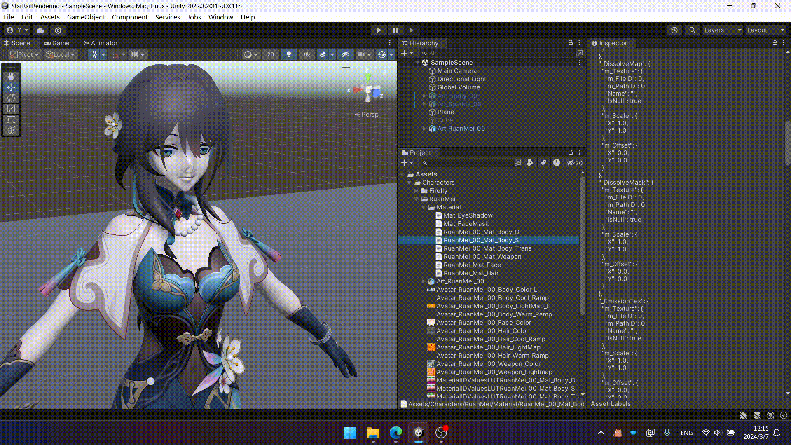
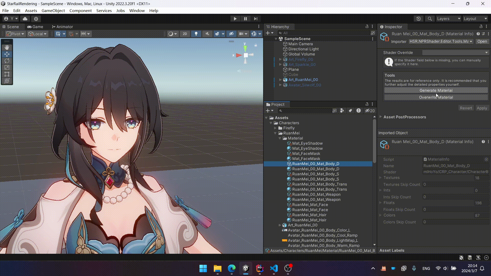

# 自动设置 Material

该 package 提供了工具，可以根据 `material.json` 自动生成 Material 或者覆写一个已经存在的 Material。



这个工具生成的结果仅供参考。一些细节的参数，比如背面是否用 UV2 等，仍然需要自己手动设置。

双击转换后的 `material.json` 文件，可以打开 `HSR Material Viewer`。它能帮你更轻松地浏览 `material.json` 文件。



## 工具扩展

引入 `HSR.NPRShader.Editor.Automation` 命名空间后，声明一个具有无参构造方法的类，派生自 `BaseMaterialSetter`。可重写的成员如下：

### Properties

|Name|Description|
|:-|:-|
|Order|优先级。数字越小优先级越高。|
|SupportedShaderMap|该类支持的 Shader 表。Key 是游戏里的 Shader 名，Value 是转换后的项目中的 Shader 名。|

### Methods

传入的参数为 `material.json` 中的对应信息，返回需要设置到 Material 上的属性列表。

|Name|Description|
|:-|:-|
|ApplyTextures|设置 Material 的 Texture 属性。|
|ApplyInts|设置 Material 的 Int 属性。|
|ApplyFloats|设置 Material 的 Float 属性。|
|ApplyColors|设置 Material 的 Color 属性。|

### 示例

``` csharp
public class FaceMaterialSetter : BaseMaterialSetter
{
    protected override IReadOnlyDictionary<string, string> SupportedShaderMap => new Dictionary<string, string>()
    {
        ["miHoYo/CRP_Character/CharacterFace"] = "Honkai Star Rail/Character/Face"
    };

    protected override IEnumerable<(string, TextureJsonData)> ApplyTextures(IReadOnlyDictionary<string, TextureJsonData> textures)
    {
        yield return ("_MainTex", textures["_MainTex"]);
        yield return ("_FaceMap", textures["_FaceMap"]);
        yield return ("_ExpressionMap", textures["_FaceExpression"]);
    }

    protected override IEnumerable<(string, float)> ApplyFloats(IReadOnlyDictionary<string, float> floats)
    {
        if (floats.TryGetValue("_UseUVChannel2", out float useUV2))
        {
            yield return ("_FaceMapUV2", useUV2);
        }

        yield return ("_EmissionThreshold", floats["_EmissionThreshold"]);
        yield return ("_EmissionIntensity", floats["_EmissionIntensity"]);

        yield return ("_NoseLinePower", floats["_NoseLinePower"]);

        yield return ("_mmBloomIntensity0", floats["_mBloomIntensity0"]);
    }

    protected override IEnumerable<(string, Color)> ApplyColors(IReadOnlyDictionary<string, Color> colors)
    {
        yield return ("_Color", colors["_Color"]);
        yield return ("_ShadowColor", colors["_ShadowColor"]);
        yield return ("_EyeShadowColor", colors["_EyeShadowColor"]);
        yield return ("_EmissionColor", Color.white);
        yield return ("_OutlineColor0", colors["_OutlineColor"]);
        yield return ("_NoseLineColor", colors["_NoseLineColor"]);

        // Texture Scale Offset
        yield return ("_Maps_ST", colors["_MainMaps_ST"]);

        // Expression
        yield return ("_ExCheekColor", colors["_ExCheekColor"]);
        yield return ("_ExShyColor", colors["_ExShyColor"]);
        yield return ("_ExShadowColor", colors["_ExShadowColor"]);
        yield return ("_ExEyeColor", colors["_ExEyeColor"]);
    }
}
```
