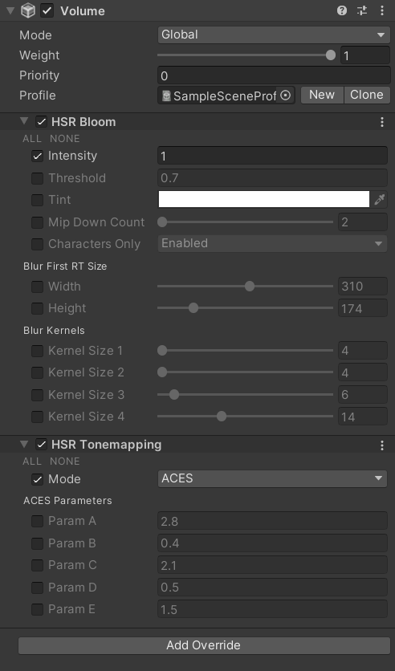

# 安装

这个包已经在 Windows 和 Android 上经过验证。

## 从 git URL 安装

**按顺序**安装这些包。第二个包要求 Unity >= 2022.3，但建议别用太高的版本。

1. https://github.com/stalomeow/ShaderUtilsForSRP.git
2. https://github.com/stalomeow/StarRailNPRShader.git

## 渲染管线设置

- 用 linear color space，别用 gamma。
- 用 `Forward` 或 `Forward+` 渲染路径。
- 关 Depth priming。
- 在 Renderer 上加 `StarRailForward` RendererFeature。

## 推荐的后处理设置

后处理很重要，请务必加上它。

## 其他建议

- 推荐开 HDR。
- 该项目自己实现了屏幕空间阴影，请别再加 URP 的 `ScreenSpaceShadows` RendererFeature。
