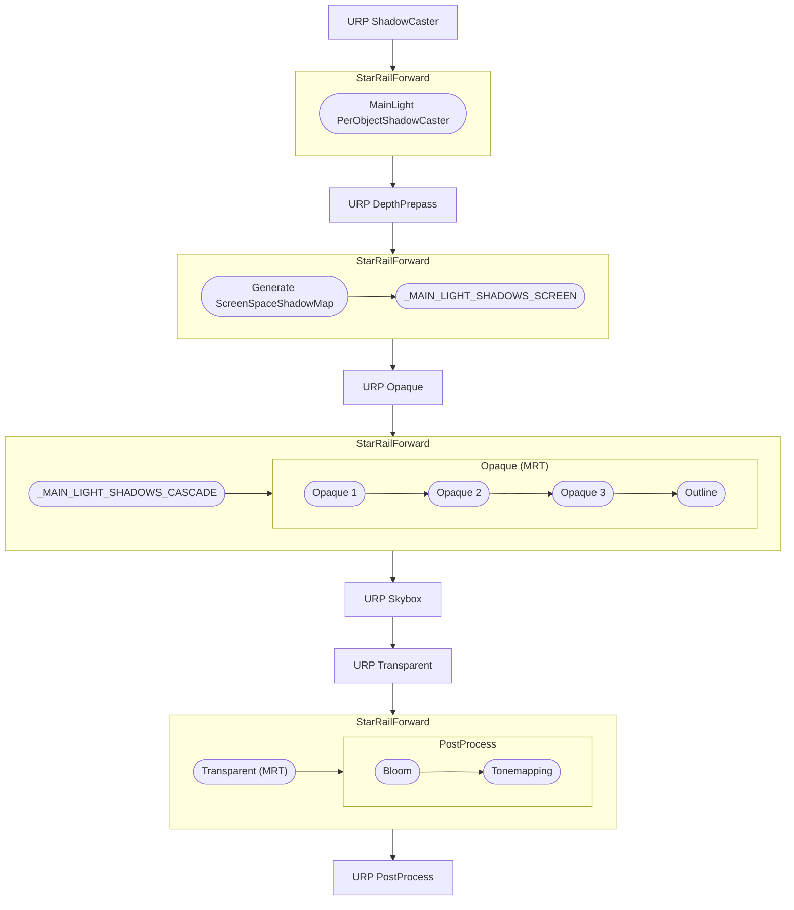

# StarRailNPRShader

> [!IMPORTANT]
> Please read this file before using the shaders!!!

[中文翻译点这里](README_CN.md)

Fan-made shaders for Unity URP attempting to replicate the shading of Honkai: Star Rail. The shaders are not 100% accurate because this project is not a reverse engineering - what I do is to replicate the in-game looks to the best of my ability.

↑↑↑ Sparkle ↑↑↑

↑↑↑ Firefly ↑↑↑

## Character shaders

- Honkai Star Rail/Character/Body
- Honkai Star Rail/Character/Body (Transparent)
- Honkai Star Rail/Character/EyeShadow
- Honkai Star Rail/Character/Face
- Honkai Star Rail/Character/FaceMask
- Honkai Star Rail/Character/Hair

The rendering of character takes advantage of MRT whose pass is always executed after UniversalForward. Transparent objects using normal URP Shader and transparent objects on characters are divided into two groups for rendering, which may cause problems.

## Post-processing

- Custom bloom using the method shared by Jack He in Unite 2018.
- Custom ACES tonemapping. The formula is

    $$f(x)=\frac{x(ax+b)}{x(cx+d)+e}$$

    where $a,b,c,d,e$ are all parameters.

## Installation

This package is verified on Windows & Android.

### Install via git URL

Install these packages **in order**. The second one requires Unity >= 2022.3, but it is recommended not to use a version that is too high.

1. https://github.com/stalomeow/ShaderUtilsForSRP.git
2. https://github.com/stalomeow/StarRailNPRShader.git

### RenderPipeline settings

- Use linear color space instead of gamma.
- Use `Forward` or `Forward+` rendering path.
- Disable depth priming.
- Add `StarRailForward` RendererFeature to the renderer.

### Recommended post-processing settings

Post-processing is important; be sure to add it.

### Per-Object Shadow for character

Add the `PerObjectShadowCaster` component to the root object of a character. It supports up to 16 shadows on the same screen.

### Other tips

- It is recommended to turn on HDR.
- Please reset the material after changing its shader.
- This project implements its own screen space shadows. Please do not add the `ScreenSpaceShadows` RendererFeature of URP again.

## Rough flow chart

## Advanced topics

- [Working with asset processor](Documentation~/WorkingWithAssetProcessor.md)
- [Working with HSRMaterialViewer](Documentation~/WorkingWithHSRMaterialViewer.md)
- [For MMD models](Documentation~/ForMMDModels.md)
- [FAQ](Documentation~/FAQ.md)

## Rules

In addition to GPL-3.0 license, please give proper credits as well as a link to this repo when redistributing or using my code.

## Special thanks

- miHoYo
- Related posts on Zhihu
- Related videos on bilibili
- °Nya°222
