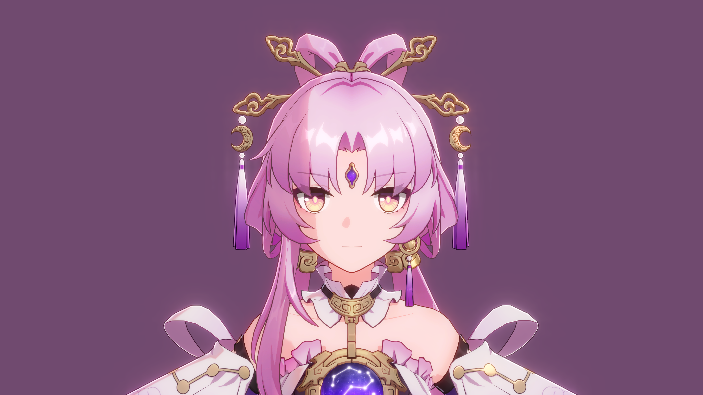

# StarRailNPRShader

> [!IMPORTANT]
> Please read this file before using the shaders!!!

[中文翻译点这里](README_CN.md)

Fan-made shaders for Unity URP attempting to replicate the shading of Honkai: Star Rail. The shaders are not 100% accurate because this project is not a reverse engineering - what I do is to replicate the in-game looks to the best of my ability.

↑↑↑ My Wife ↑↑↑

↑↑↑ Also My Wife ↑↑↑

↑↑↑ Our Mum ↑↑↑

## Shaders included

- Honkai Star Rail/Character/Body
- Honkai Star Rail/Character/Body (Transparent)
- Honkai Star Rail/Character/EyeShadow
- Honkai Star Rail/Character/Face
- Honkai Star Rail/Character/Hair

The rendering of character takes advantage of MRT whose pass is always executed after UniversalForward. As a result, when it comes to transparent objects, the rendering result may go wrong. 

*To maintain this project more easily, I won't rewrite the whole render pipeline. You can do it yourself.

## Extra features

Asset preprocess:

- Automatically smooth the normals of character models and store them into tangents. The file name of the model must match pattern `^Avatar_.+_00$`, e.g., `Avatar_Kafka_00`.
- Automatically process textures (if you haven't changed the file names after ripping them).

PostProcessing:

- Custom bloom using the method shared by Jack He in Unite 2018.
- Custom ACES tonemapping. The formula is

    $$f(x)=\frac{x(ax+b)}{x(cx+d)+e}$$

    where $a,b,c,d,e$ are all parameters.

## Requirements

- Basic knowledge of anime style rendering.
- Unity 2022.3 (Recommended).
- Universal RP 14.0 (Recommended) or higher.
- My [ShaderUtilsForSRP](https://github.com/stalomeow/ShaderUtilsForSRP) package.
- (Optional) Newtonsoft Json package 3.2.1 or higher.

Newtonsoft Json is used by a custom editor util called `Game Material Inspector` which can help us read Material JSON files ripped by a certain tool. To enable that util, add the scripting define symbol `PACKAGE_NEWTONSOFT_JSON` in player settings after importing Newtonsoft Json package.

## Guide

- Use linear color space instead of gamma.
- HDR should be enabled.
- Depth priming must be disabled.
- Depth texture must be enabled and generated by a depth prepass.
- Rendering path must be forward currently.
- Renderer Feature `StarRailForward` must be added to the renderer.
- Make good use of [the extra features](#extra-features) mentioned above! They are important.
- Reset the material after changing its shader.

### Recommended post-processing settings

### For MMD models

Some extra steps must be done:

- Change `Model Type` to `MMD` on each material.
- Add component `SyncMMDHeadBone` to the GameObject to which SkinnedMeshRenderer is attached.

    

**Note that** MMD models do not contain some detailed information so the final rendering result may not fully meet your expectation.

## Rules

In addition to GPL-3.0 license, please give proper credits as well as a link to this repo when redistributing or using my code.

## Special thanks

- miHoYo
- Related posts on Zhihu
- Related videos on bilibili
- °Nya°222

## FAQ

### Why outlines/rim-lights do not work?

Change the `Model Scale` at the top of the material.