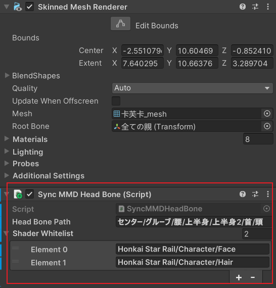

# StarRailNPRShader

> [!IMPORTANT]
> Please read this file before using the shaders!!!

[中文翻译点这里](README_CN.md)

Fan-made shaders for Unity URP attempting to replicate the shading of Honkai: Star Rail. The shaders are not 100% accurate because this project is not a reverse engineering - what I do is to replicate the in-game looks to the best of my ability.

↑↑↑ Sparkle ↑↑↑

↑↑↑ Firefly ↑↑↑

## Character Shaders

- Honkai Star Rail/Character/Body
- Honkai Star Rail/Character/Body (Transparent)
- Honkai Star Rail/Character/EyeShadow
- Honkai Star Rail/Character/Face
- Honkai Star Rail/Character/FaceMask
- Honkai Star Rail/Character/Hair

The rendering of character takes advantage of MRT whose pass is always executed after UniversalForward. Transparent objects using normal URP Shader and transparent objects on characters are divided into two groups for rendering, which may cause problems.

## Post-processing

- Custom bloom using the method shared by Jack He in Unite 2018.
- Custom ACES tonemapping. The formula is

    $$f(x)=\frac{x(ax+b)}{x(cx+d)+e}$$

    where $a,b,c,d,e$ are all parameters.

## Install via git URL

**This package requires Unity >= 2022.3.**

1. https://github.com/stalomeow/ShaderUtilsForSRP.git
2. https://github.com/stalomeow/StarRailNPRShader.git

## Guide

- Use linear color space instead of gamma.
- HDR should be enabled.
- Depth priming must be disabled.
- Depth texture must be enabled and generated by a depth prepass.
- Rendering path must be forward currently.
- Renderer Feature `StarRailForward` must be added to the renderer.
- Reset the material after changing its shader.
- This project implements its own screen space shadows. Please do not add the `ScreenSpaceShadows` RendererFeature of URP.

### Recommended post-processing settings

### Per-Object Shadow

Add the `PerObjectShadowCaster` component on the root object of a character. It supports up to 16 shadows on the same screen.

### Working with asset preprocessor

The asset preprocessor can

- Automatically smooth the normals of character models and store them into tangents.
- Automatically process textures.

The path patterns of the assets that need preprocessing can be configured in `Project Settings/Honkai Star Rail/NPR Shader`. The default patterns are designed to align with the naming style of in-game assets.

### Working with HSRMaterialViewer

HSRMaterialViewer can help you view `material.json` files and automatically assign some properties (not all properties) of materials. **Applying Floats and Ints are not well supported by this tool.**

### For MMD models

Some extra steps must be done:

- Switch `Model Type` to `MMD` on each material.
- Add component `SyncMMDHeadBone` to the GameObject to which SkinnedMeshRenderer is attached.

    

    You can override the direction values of the head bone. Besides, two presets are provided in the context menu of the component.

    

**Note that** MMD models do not contain some detailed information so the final rendering result may not fully meet your expectation.

## Rules

In addition to GPL-3.0 license, please give proper credits as well as a link to this repo when redistributing or using my code.

## Special thanks

- miHoYo
- Related posts on Zhihu
- Related videos on bilibili
- °Nya°222

## FAQ

### Why outlines/rim-lights do not work?

Change the `Model Scale` at the top of the material.