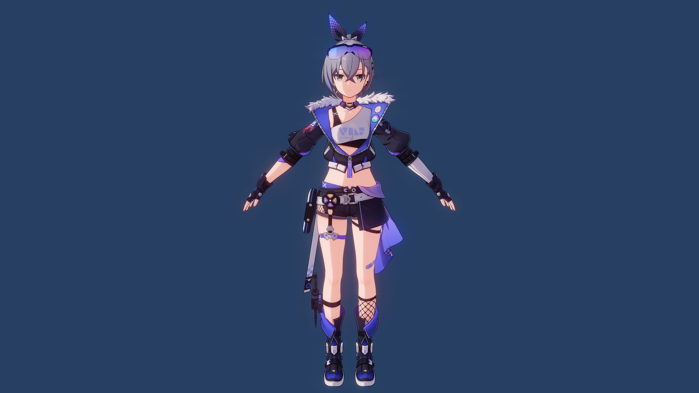
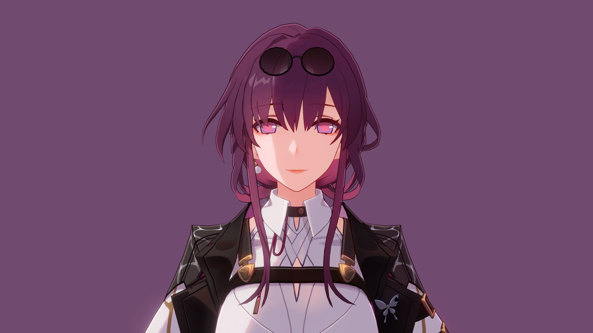

# StarRailNPRShader

> [!IMPORTANT]
> 求求了，看看 README 吧！

这是基于 Unity URP 的仿星穹铁道渲染 Shader。这不是逆向工程，Shader 代码不可能和游戏里的一模一样，我只是尽力去还原渲染效果。

↑↑↑ 我老婆 ↑↑↑

↑↑↑ 我老婆 ↑↑↑

↑↑↑ 也是我老婆 ↑↑↑

↑↑↑ 咱妈 ↑↑↑

## 角色着色器

- Honkai Star Rail/Character/Body
- Honkai Star Rail/Character/Body (Transparent)
- Honkai Star Rail/Character/EyeShadow
- Honkai Star Rail/Character/Face
- Honkai Star Rail/Character/Hair

角色渲染用了 MRT，这个 MRT Pass 是在 URP 的 Forward Pass 之后执行的。渲染透明物体的时候可能会出问题。

*为了维护起来方便，我不会重写整个渲染管线，你可以自己来。

## 屏幕后处理

- 自定义 Bloom 效果。用的贺甲在 Unite 2018 上分享的方法。
- 自定义 ACES tonemapping。公式是

    $$f(x)=\frac{x(ax+b)}{x(cx+d)+e}$$

    其中 $a,b,c,d,e$ 都是参数。

## 要求

- 卡通渲染的基础知识！！！
- Unity >= 2022.3。
- Universal RP >= 14.0。
- 我的 [ShaderUtilsForSRP](https://github.com/stalomeow/ShaderUtilsForSRP) 包。
- (可选) Newtonsoft Json 包 >= 3.2.1。

Newtonsoft Json 被一个叫 `Game Material Inspector` 的编辑器工具使用。游戏里的材质解包以后是存在 JSON 里的，这个工具可以帮我们阅读 JSON 内容。想启用这个工具的话，先导入 Newtonsoft Json，再往 player settings 里加编译条件 `PACKAGE_NEWTONSOFT_JSON`。

## 指南

- 用 linear color space，别用 gamma。
- 开 HDR。
- 关 Depth priming。
- 开 Depth texture 和 Depth prepass。
- 目前只能用 Forward 渲染路径。
- 在 Renderer 上加 Renderer Feature `StarRailForward`。
- 材质球换 Shader 以后记得先重置一下。

### 推荐的后处理设置

### 使用资源预处理器

资源预处理器能

- 自动平滑角色模型的法线，然后存进切线里。
- 自动处理贴图。

可以在 `Project Settings/Honkai Star Rail/NPR Shader` 中配置需要被预处理的资源的路径模式。默认的路径模式旨在与游戏内资源的命名风格保持一致。

### 关于 MMD 模型

需要额外加几个步骤：

- 在材质球上面把 `Model Type` 换成 `MMD`。
- 在挂有 SkinnedMeshRenderer 的游戏物体上加一个 `SyncMMDHeadBone` 组件。

    

    现在，头骨骼方向的值可以自行设置了。另外，组件的菜单里还提供了两个预设。

    

**注意：** MMD 模型缺少一些细节信息，所以最后渲染出来可能没有想象中那么好。

## 规则

当使用或者再发行我的代码时，除了遵守 GPL-3.0 协议，请提供这个代码仓库的链接并注明原作者。

## 特别感谢

- 米哈游
- 知乎上相关的文章
- 哔哩哔哩上相关的视频
- °Nya°222

## 常见问题

### 为啥没有描边/边缘光？

在材质球上面修改 `Model Scale`。