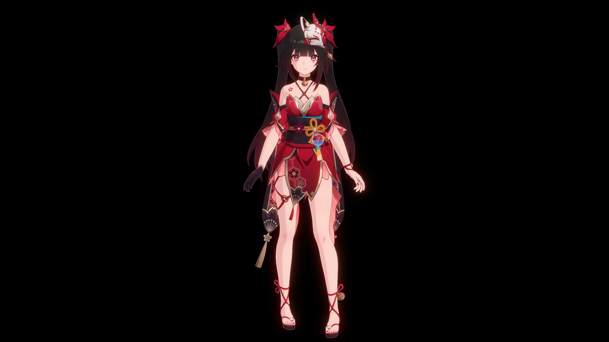
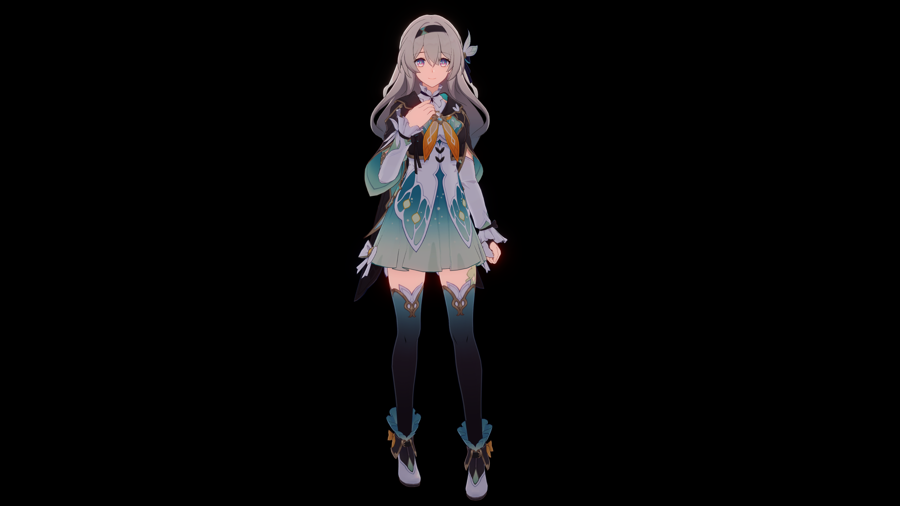
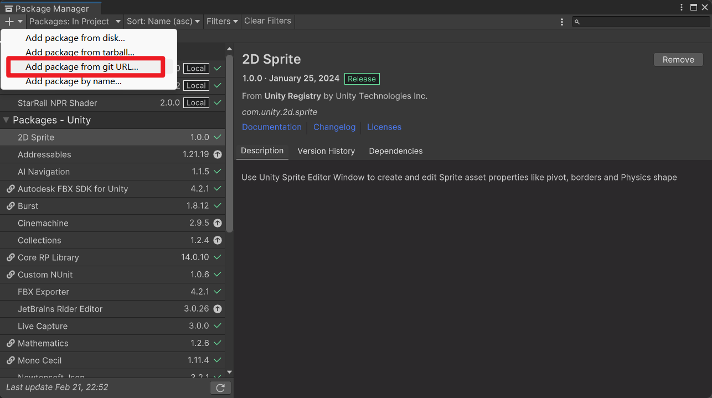
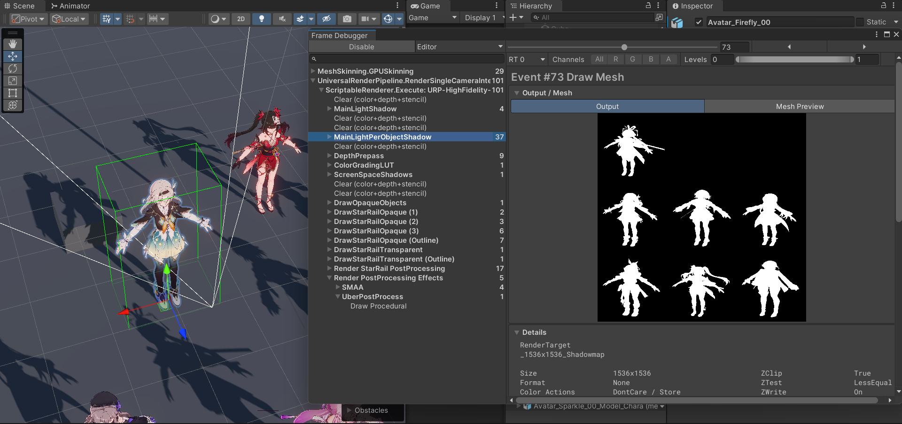
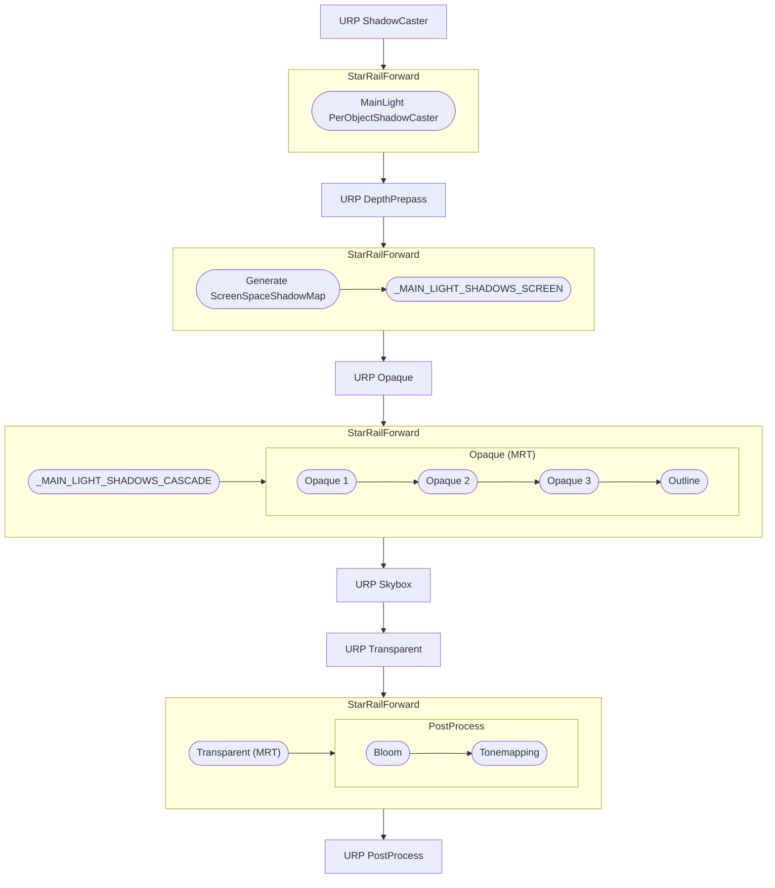

# StarRailNPRShader

> [!IMPORTANT]
> 求求了，看看 README 吧！

这是基于 Unity URP 的仿星穹铁道渲染 Shader。这不是逆向工程，Shader 代码不可能和游戏里的一模一样，我只是尽力去还原渲染效果。

↑↑↑ 花火 ↑↑↑

↑↑↑ 流萤 ↑↑↑

## 角色着色器

- Honkai Star Rail/Character/Body
- Honkai Star Rail/Character/Body (Transparent)
- Honkai Star Rail/Character/EyeShadow
- Honkai Star Rail/Character/Face
- Honkai Star Rail/Character/FaceMask
- Honkai Star Rail/Character/Hair

角色渲染用了 MRT，这个 MRT Pass 是在 URP 的 Forward Pass 之后执行的。使用普通 URP Shader 的透明物体和角色身上的透明物体被分成了两批渲染，可能会出问题。

## 屏幕后处理

- 自定义 Bloom 效果。用的贺甲在 Unite 2018 上分享的方法。
- 自定义 ACES tonemapping。公式是

    $$f(x)=\frac{x(ax+b)}{x(cx+d)+e}$$

    其中 $a,b,c,d,e$ 都是参数。

## 安装

这个包已经在 Windows 和 Android 上经过验证。

### 从 git URL 安装

**按顺序**安装这些包。第二个包要求 Unity >= 2022.3，但建议别用太高的版本。

1. https://github.com/stalomeow/ShaderUtilsForSRP.git
2. https://github.com/stalomeow/StarRailNPRShader.git

### 渲染管线设置

- 用 linear color space，别用 gamma。
- 用 `Forward` 或 `Forward+` 渲染路径。
- 关 Depth priming。
- 在 Renderer 上加 `StarRailForward` RendererFeature。

### 推荐的后处理设置

后处理很重要，请务必加上它。

### 角色的逐物体阴影

在角色根物体上添加 `PerObjectShadowCaster` 组件。支持同屏最多 16 个角色阴影。

### 其他建议

- 推荐开 HDR。
- 材质球换 Shader 以后记得先重置一下。
- 该项目自己实现了屏幕空间阴影，请别再加 URP 的 `ScreenSpaceShadows` RendererFeature。

## 大致流程图

## 高级主题

- [使用资产处理器](Documentation~/WorkingWithAssetProcessor_CN.md)
- [使用 HSRMaterialViewer](Documentation~/WorkingWithHSRMaterialViewer_CN.md)
- [关于 MMD 模型](Documentation~/ForMMDModels_CN.md)
- [常见问题](Documentation~/FAQ_CN.md)

## 规则

当使用或者再发行我的代码时，除了遵守 GPL-3.0 协议，请提供这个代码仓库的链接并注明原作者。

## 特别感谢

- 米哈游
- 知乎上相关的文章
- 哔哩哔哩上相关的视频
- °Nya°222
